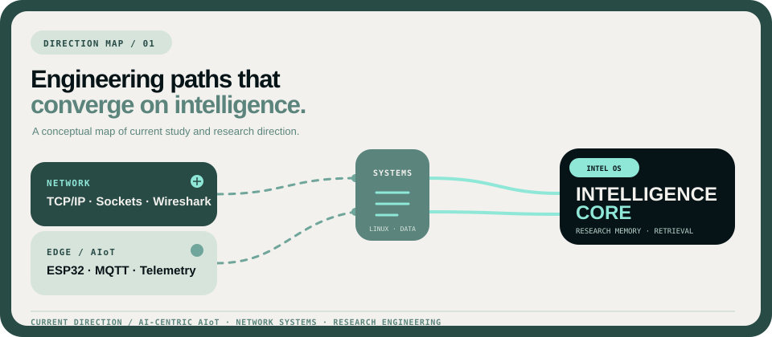

<!--
  =============================================================================
  Phuchello / GitHub Profile README Template
  AUTO-GENERATED via scripts/render_profile.py from data/*.yml
  DO NOT EDIT README.md DIRECTLY. Edit data/profile.yml, data/projects.yml,
  or data/stack.yml, then run: python scripts/render_profile.py
  =============================================================================
-->

<div align="center">
  
</div>

```text
NOC CONSOLE :: PHUCHELLO.NET
SYS_STATE: ONLINE

IDENTITY    Võ Trọng Phúc / Phuchello
FOCUS       Network Engineering · AIoT · Research Systems
AFFILIATION University of Information Technology — VNU-HCM (UIT)
LOCATION    Ho Chi Minh City, Vietnam

MISSION     Building intelligent systems where networks, edge devices, and
            AI meet.
```

## // 01. ENGINEERING & RESEARCH FOCUS

Undergraduate student at UIT (VNU-HCM) working on research-oriented systems. Interested in how networked devices, backend services, and research data can work together reliably.

* **Network Engineering & Observability** — Socket programming (TCP/UDP), application-layer protocols (HTTP/REST, SMTP, FTP), RAW socket sniffing, and packet analysis with Wireshark.
* **Edge Systems & AIoT** — Microcontroller interfacing (ESP32), sensor telemetry streams, and lightweight MQTT pub/sub messaging.
* **Research Intelligence & Data Systems** — Provenance-first data modeling, asynchronous academic metadata ingestion (arXiv, Crossref, OpenAlex, Semantic Scholar), and vector search with pgvector.

---

## // 02. SYSTEM ARCHITECTURE & RESEARCH TRAJECTORY

A conceptual map of technical directions spanning physical sensing, network transport, data engineering, and personal research memory.

<div align="center">
  
</div>

---

## // 03. TECHNICAL CAPABILITIES BY SYSTEM LAYER

### `// LAYER :: NETWORKING`
> *Transport protocols, socket programming, and packet inspection*

| Capability | Level | Focus / Engineering Details |
|---|---|---|
| **TCP/IP & UDP** | `Demonstrated` | Stream framing, datagram boundaries, 3-way handshake mechanics |
| **Socket Programming** | `Demonstrated` | Client-server architectures, non-blocking I/O, multi-client concurrency |
| **Application Protocols** | `Demonstrated` | HTTP/1.1, REST APIs, SMTP, POP3, IMAP, FTP |
| **Packet Observability** | `Demonstrated` | Packet analysis with Wireshark, display filters, RAW socket packet capture |
| **Network Security Basics** | `Demonstrated` | AES-256 payload encryption, SHA-256 integrity hashing |

### `// LAYER :: EDGE & AIoT`
> *Physical sensing, microcontroller interfacing, and distributed telemetry*

| Capability | Level | Focus / Engineering Details |
|---|---|---|
| **ESP32 & Microcontrollers** | `Practicing` | Hardware GPIO control, sensor polling, serial communication |
| **MQTT Protocol** | `Practicing` | Lightweight pub/sub messaging, QoS levels, telemetry transport |
| **Sensors & Peripherals** | `Practicing` | Analog/digital data acquisition, environment telemetry |
| **Edge Telemetry Pipelines** | `Exploring` | Local data filtering, sensor dispatch to service gateways |

### `// LAYER :: SYSTEMS & DATA CORE`
> *Operating system primitives, data engines, and foundational tooling*

| Capability | Level | Focus / Engineering Details |
|---|---|---|
| **Linux / POSIX** | `Practicing` | Shell scripting, process management, file I/O streams |
| **PostgreSQL 16** | `Demonstrated` | Relational modeling, async drivers (asyncpg), ACID transactions, Alembic migrations |
| **Docker & Compose** | `Practicing` | Multi-container service environments, reproducible local setups |
| **C / C++** | `Demonstrated` | Manual memory allocation, pointer mechanics, algorithmic optimization |
| **Git Workflows** | `Practicing` | Branching, version control, and repository workflows |

### `// LAYER :: CLOUD & INFRASTRUCTURE`
> *Deployment environments, CI/CD automation, and async service design*

| Capability | Level | Focus / Engineering Details |
|---|---|---|
| **Multi-Container Services** | `Practicing` | Docker Compose service configuration, health checks, volume management |
| **CI/CD Automation** | `Practicing` | GitHub Actions workflows, automated testing, schema verification |
| **Async Service Design** | `Demonstrated` | Asynchronous task execution, retry/backoff policies, rate limiting |

### `// LAYER :: INTELLIGENCE & RESEARCH`
> *Scientific data ingestion, vector search, and provenance engineering*

| Capability | Level | Focus / Engineering Details |
|---|---|---|
| **Python 3.12 Ecosystem** | `Demonstrated` | FastAPI async, Pydantic v2 validation, SQLAlchemy 2.0 async ORM |
| **Vector Search** | `Demonstrated` | Vector search with pgvector, similarity retrieval |
| **Scientific Ingestion** | `Demonstrated` | Metadata pipelines for arXiv, Crossref, OpenAlex, Semantic Scholar |
| **Provenance Modeling** | `Demonstrated` | Durable evidence-to-claim lineage, idempotent record reconciliation |

---

## // 04. FEATURED SYSTEMS & REPOSITORIES

### [Intel OS (NCKH)](https://github.com/Phuchello/NCKH)
**Category:** `Research Intelligence & Systems` &nbsp;|&nbsp; **Status:** `Active (G2 Ingestion Review)` &nbsp;|&nbsp; **Stack:** `Python 3.12` · `FastAPI (Async)` · `PostgreSQL 16 + pgvector` · `SQLAlchemy 2.x / asyncpg` · `Alembic Migrations` · `Docker Compose`

> **A personal research intelligence platform organizing scientific literature into structured research memory**

Modular backend platform featuring async HTTP ingestion pipelines for academic metadata (arXiv, Crossref, OpenAlex, Semantic Scholar), conservative multi-source reconciliation, and PostgreSQL vector storage with pgvector.

🔗 **Links:** [Repository](https://github.com/Phuchello/NCKH) · [Docs](https://github.com/Phuchello/NCKH/blob/main/docs/PUBLIC_PROGRESS.md)

---

### [NT106 Network Programming Handbook](https://github.com/Phuchello/NT106_UIT_HANDBOOK)
**Category:** `Network Engineering & Observability` &nbsp;|&nbsp; **Status:** `Completed / Reference` &nbsp;|&nbsp; **Stack:** `TCP / UDP Sockets` · `RAW Sockets (Promiscuous)` · `Wireshark Analysis` · `HTTP / REST APIs` · `Multithreaded I/O` · `AES-256 / SHA-256`

> **Systems engineering handbook covering socket programming, application protocols, and packet sniffing**

18-chapter practical reference for Network Programming at UIT. Covers TCP/UDP socket architectures, application layer protocols (HTTP, SMTP, FTP), RAW socket sniffing, and packet analysis with Wireshark.

🔗 **Links:** [Repository](https://github.com/Phuchello/NT106_UIT_HANDBOOK) · [Web View](https://github.com/Phuchello/NT106_UIT_HANDBOOK/blob/main/NT106_CamNang_LapTrinhMang_UIT_VoTrongPhuc_PRECODEX.pdf)

---

### [DSA Comprehensive Handbook](https://github.com/Phuchello/DSA_UIT_HANDBOOK)
**Category:** `Algorithms & Systems Foundations` &nbsp;|&nbsp; **Status:** `Completed / Reference` &nbsp;|&nbsp; **Stack:** `C++ / STL` · `Tree Algorithms (AVL, B-Tree)` · `Graph Algorithms (Dijkstra, BFS/DFS)` · `Complexity Proofs` · `Dry-Run Tracing` · `KaTeX Math`

> **Data structures and algorithms reference with dry-run tables and complexity analysis**

16-chapter reference covering algorithmic complexity (Big-O/Omega/Theta), sorting algorithms with memory and stability analysis, pointer-based tree structures (BST, AVL, B-Tree, Heaps), and graph algorithms.

🔗 **Links:** [Repository](https://github.com/Phuchello/DSA_UIT_HANDBOOK) · [Web View](https://phuchello.github.io/DSA_UIT_HANDBOOK/)

---

## // 05. CURRENT RESEARCH & LEARNING TRAJECTORY

* **Intel OS (NCKH) G2 Ingestion Review** — Refining multi-provider academic metadata reconciliation, idempotent database upserts, and resilient async HTTP rate-limiting.
* **Network Observability & Protocols** — Deepening packet analysis techniques, custom protocol dissection, and socket concurrency models.
* **Edge Telemetry Pipelines** — Experimenting with ESP32 sensor nodes transmitting structured telemetry via MQTT to containerized services.

---

## // 06. CONNECT & TELEMETRY

<div align="center">

```text
[phuchello@noc-uit-01 ~]$ whoami
Võ Trọng Phúc / Phuchello
[phuchello@noc-uit-01 ~]$ focus
Networking · AIoT · Research Engineering
[phuchello@noc-uit-01 ~]$ status
learning · building · researching
```

[](https://github.com/Phuchello) [](https://www.linkedin.com/in/phucvopro/)

</div>
