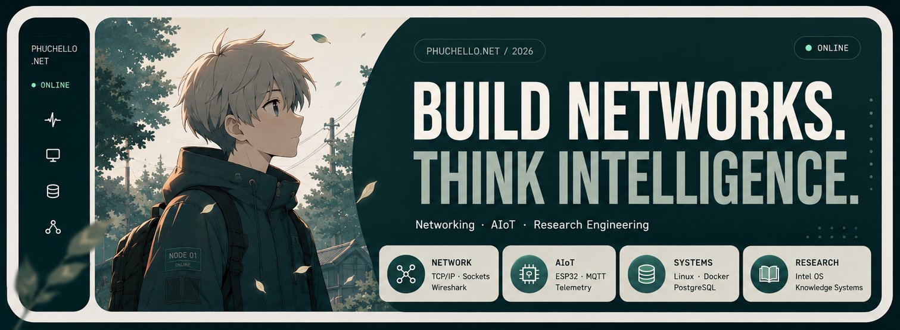

<!--
  =============================================================================
  Phuchello / GitHub Profile README Template
  AUTO-GENERATED via scripts/render_profile.py from data/*.yml
  DO NOT EDIT README.md DIRECTLY. Edit data/profile.yml or data/stack.yml,
  then run: python scripts/render_profile.py
  =============================================================================
-->

  

{{INTRO_BLOCK}}

## // 01. FOCUS

{{OVERVIEW_BLOCK}}

---

## // 02. RESEARCH INTERESTS

{{RESEARCH_INTERESTS_BLOCK}}

---

## // 03. DIRECTION MAP

  

---

## // 04. TECH STACK

{{SYSTEM_STACK_BLOCK}}

---

## // 05. NOW EXPLORING

{{NOW_EXPLORING_BLOCK}}

---

## // 06. CONNECT

{{CONNECT_BLOCK}}
